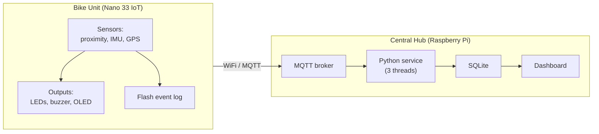

# CycleGuard

An intelligent cyclist safety system that warns riders about close vehicle passes in real time and logs every close call and impact to a central dashboard for later analysis.

Built for SIT210 Embedded Systems Development.

---

## What it does

CycleGuard is a two-part distributed embedded system:

- A **bike unit** (Arduino Nano 33 IoT) detects vehicles passing close to the rear of the bike and warns the rider with colour-coded LEDs and a buzzer. It also detects impacts using the onboard accelerometer, and logs every incident with a GPS location.
- A **central hub** (Raspberry Pi 5) receives incidents over MQTT, stores them in a database, and shows them on a live web dashboard.

The system is **offline-first**: every incident is stored to flash before any network attempt, so a WiFi outage or a dead power bank never causes data loss. Events sync automatically when connectivity returns.

---

## Architecture

See [docs/architecture.md](docs/architecture.md) for full block, flow, sequence, and state diagrams.



---

## Repository structure

```
cycleguard/
├── README.md
├── .gitignore
├── bike-node/
│   ├── CycleGuard_BikeNode.ino   # Arduino firmware
│   └── arduino_secrets.example.h      # credential template
├── hub/
│   ├── hub.py                         # Python service (3 threads)
│   ├── requirements.txt
│   └── templates/
│       └── dashboard.html             # web dashboard
└── docs/
    └── architecture.md                # Mermaid diagrams
```

---

## Hardware

| Component | Role | Interface |
|---|---|---|
| Arduino Nano 33 IoT | Bike controller | - |
| APDS-9960 | Rear proximity sensor | I2C (0x39) |
| LSM6DS3 IMU | Impact detection (built into Nano) | I2C (0x6A) |
| GPS NEO-6M | Location | UART |
| WS2812B LED strip (8 LEDs) | Rider warning | GPIO D6 |
| Piezo buzzer | Audio alert | GPIO D9 |
| SSD1309 OLED | Status display | I2C (0x3C) |
| Push button | Power toggle | GPIO D7 |
| Raspberry Pi 5 | Central hub | - |

### Bike wiring

All sensors share 3.3V and a common ground. The LED strip runs on 5V (Nano VUSB).

| Component | Pin |
|---|---|
| APDS Vin / OLED VCC / GPS VCC | 3.3V rail |
| APDS SDA / OLED SDA | A4 |
| APDS SCL / OLED SCL | A5 |
| GPS TX | D0 (RX) |
| GPS RX | D1 (TX) |
| LED strip data | D6 (via 470 ohm resistor) |
| LED strip 5V | VUSB |
| Buzzer + | D9 |
| Button | D7 and GND |

---

## Setup

### Bike firmware

1. Install Arduino IDE 2.x and the **Arduino SAMD Boards** package.
2. Install these libraries via Library Manager:
  . WiFiNINA
  . ArduinoMqttClient
  . Adafruit APDS9960
  . Adafruit NeoPixel
  . Adafruit GFX Library
  . Adafruit SSD1306
  . TinyGPSPlus
  . FlashStorage
  . Arduino_LSM6DS3
3. Copy `bike-node/arduino_secrets.example.h` to `bike-node/arduino_secrets.h` and fill in your WiFi credentials and the Pi's IP address.
4. Open `bike-node/CycleGuard_BikeNode_Full.ino`, select **Arduino Nano 33 IoT** as the board, and upload.

The Nano 33 IoT only supports 2.4 GHz WiFi.

### Raspberry Pi hub

```bash
# Install dependencies
sudo apt update
sudo apt install -y mosquitto mosquitto-clients sqlite3 python3-venv

# Configure Mosquitto to listen on the LAN
sudo tee /etc/mosquitto/conf.d/cycleguard.conf > /dev/null <<'EOF'
listener 1883 0.0.0.0
allow_anonymous true
EOF
sudo systemctl restart mosquitto

# Set up and run the hub service
git clone <this-repo> ~/cycleguard
cd ~/cycleguard/hub
python3 -m venv .venv
source .venv/bin/activate
pip install -r requirements.txt
python3 hub.py
```

Open the dashboard at `http://<pi-ip>:5000`.

---

## Usage

1. Power on the bike unit and press the button to turn the system on.
2. The OLED shows the live alert state and connection status (W = WiFi, M = MQTT).
3. As objects approach the rear sensor, the LEDs change colour: green, yellow, red, flashing red.
4. Sustained close passes and impacts are logged and appear on the dashboard.

### Serial commands (115200 baud)

| Command | Effect |
|---|---|
| `dump` | Print the full event log with publish status |
| `clear` | Wipe the event log |
| `sync` | Force a sync of pending events |
| `status` | Print WiFi, MQTT, sensor, and queue status |

---

## Fault tolerance

The system tolerates four classes of failure:

- **Network outage:** events are stored to flash and replayed automatically on reconnect (offline-first).
- **Sensor failure:** a heartbeat detects a stuck proximity sensor and falls back to a magenta warning so the rider is never left silent.
- **Power loss:** the bike runs on a USB power bank; because all incident data is in non-volatile flash and state rebuilds from flash on boot, a power cut loses nothing.
- **Half-open connections:** a short MQTT keepalive plus force-disconnect on publish failure detects a dead broker within seconds.

---

## License

MIT