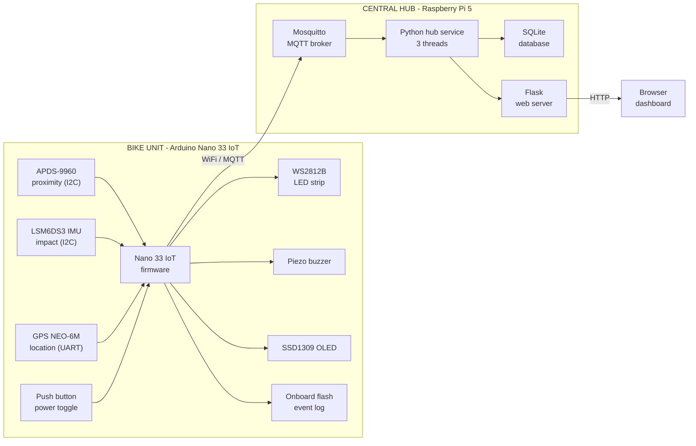
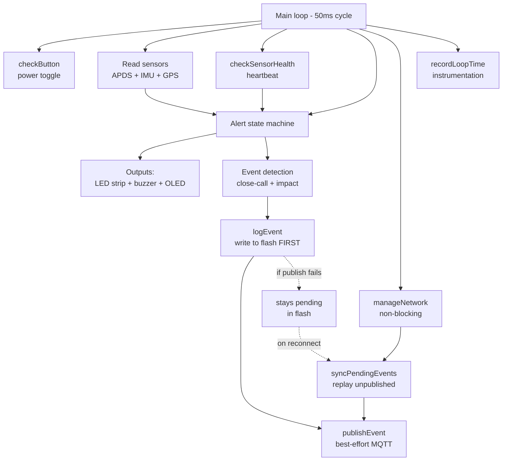
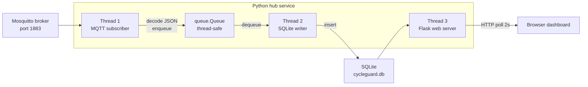
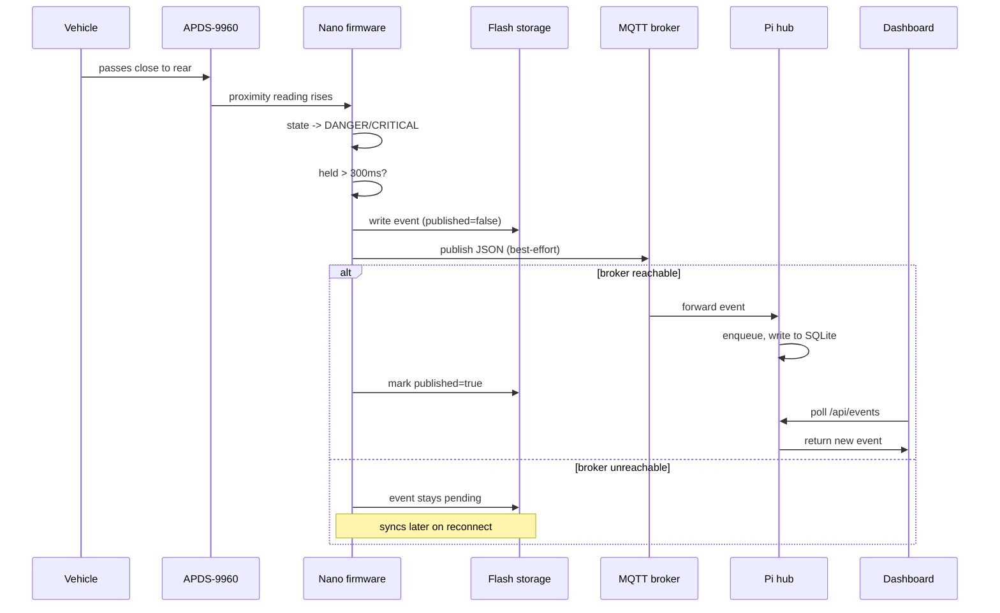
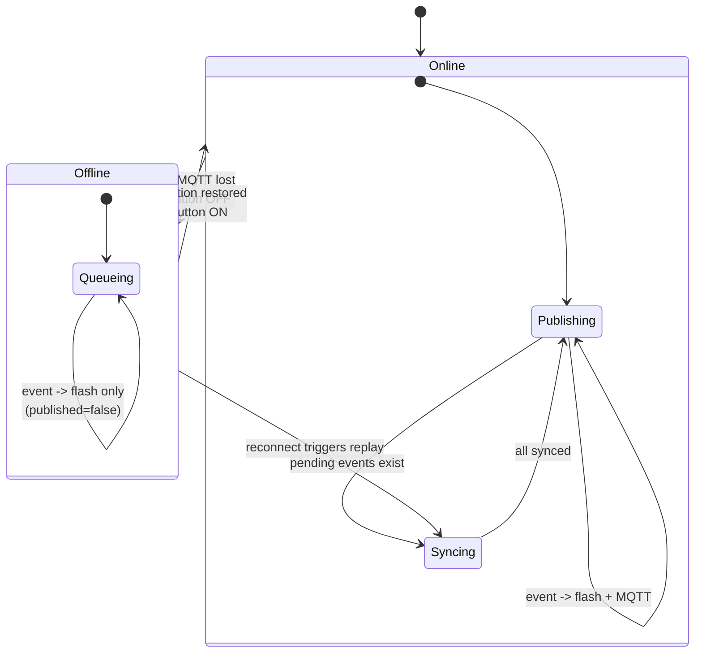
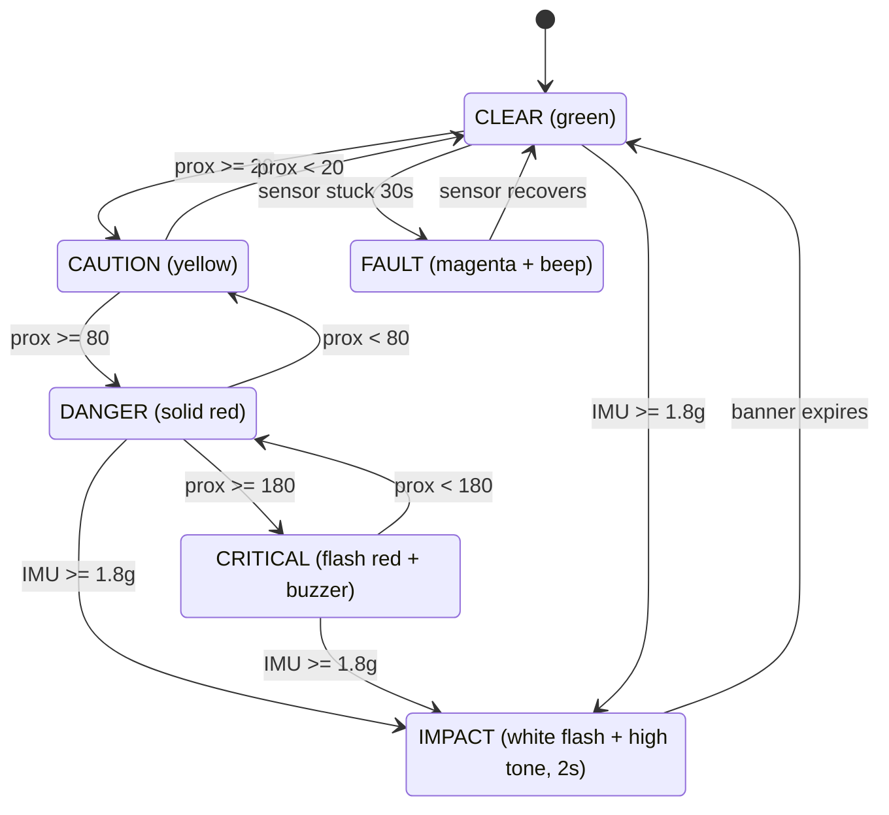
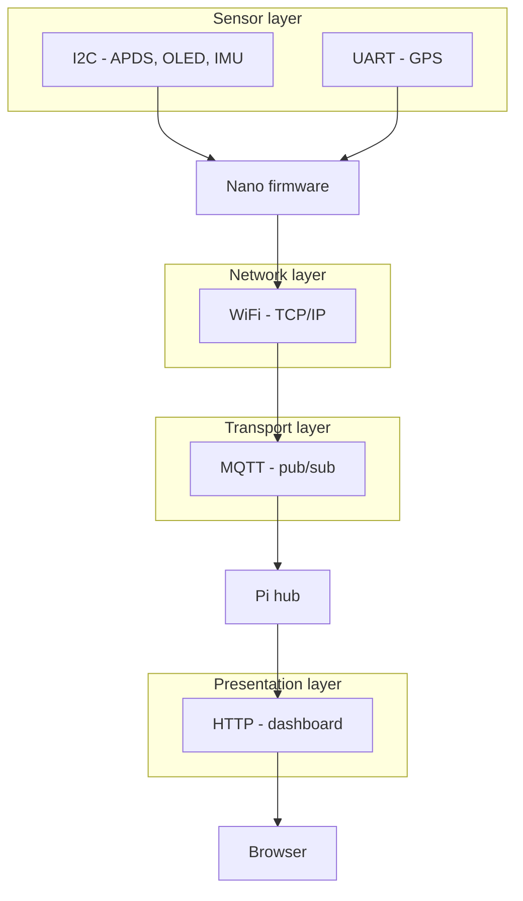

# CycleGuard Architecture Diagrams

---

## 1. System overview (block diagram)

---

## 2. Bike node internal architecture

---

## 3. Central hub threading model

---

## 4. Close-call event flow (sequence diagram)

---

## 5. Offline-first fault tolerance (state diagram)

---

## 6. Alert state machine

---

## 7. Communication protocols

